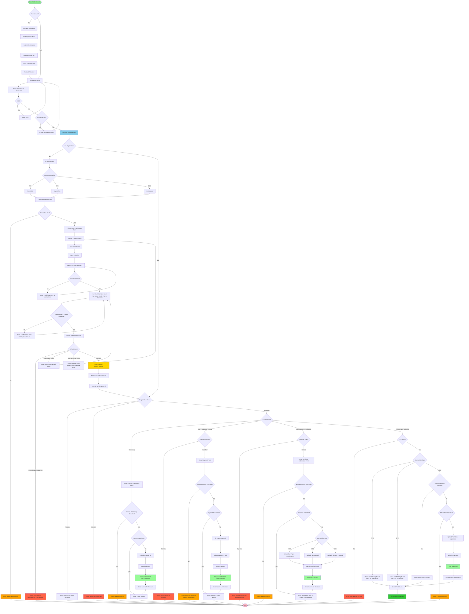

```mermaid
flowchart TD
    Start([User Visits Website]) --> CheckAuth{Has Account?}
    
    CheckAuth -->|No| Register[Navigate to /register]
    Register --> FillRegForm[Fill Registration Form]
    FillRegForm --> SubmitReg[Submit Registration]
    SubmitReg --> EmailSent[Activation Email Sent]
    EmailSent --> ClickActivation[Click Activation Link]
    ClickActivation --> AccountActivated[Account Activated]
    AccountActivated --> LoginPage
    
    CheckAuth -->|Yes| LoginPage[Navigate to /login]
    LoginPage --> EnterCreds[Enter Username & Password]
    EnterCreds --> AuthValidate{Valid?}
    AuthValidate -->|No| LoginError[Show Error]
    LoginError --> LoginPage
    AuthValidate -->|Yes| ActiveCheck{Account Active?}
    ActiveCheck -->|No| ActivatePrompt[Prompt: Activate Account]
    ActivatePrompt --> LoginPage
    ActiveCheck -->|Yes| Dashboard[Redirect to /dashboard]
    
    Dashboard --> HasReg{Has Registration?}
    
    HasReg -->|No| BrowseEvents[Browse /events]
    BrowseEvents --> SelectComp{Select Competition}
    SelectComp -->|PTC| PTCPage["/events/ptc"]
    SelectComp -->|TPC| TPCPage["/events/tpc"]
    SelectComp -->|BCC| BCCPage["/events/bcc"]
    
    PTCPage --> RegForm
    TPCPage --> RegForm
    BCCPage --> RegForm
    
    RegForm[Click Registration Button] --> CheckRegDeadline{Before Deadline?}
    CheckRegDeadline -->|No| DeadlinePassed[Show: Registration Closed]
    DeadlinePassed --> End
    
    CheckRegDeadline -->|Yes| TeamForm[Show Team Registration Form]
    TeamForm --> Section1[Section 1: Team Identity]
    Section1 --> InputTeamName[Input Team Name]
    InputTeamName --> InputInstitution[Input Institution]
    
    InputInstitution --> Section2[Section 2: Team Members]
    Section2 --> ValidateSize{Team Size Valid?}
    ValidateSize -->|No| SizeError[Show: Invalid team size for competition]
    SizeError --> Section2
    
    ValidateSize -->|Yes| InputMembers[For Each Member: Input Full Name, Email, Phone, Proof Link]
    InputMembers --> CheckLeaderEmail{Leader Email = Logged User Email?}
    CheckLeaderEmail -->|No| EmailMismatch[Show: Leader email must match your account]
    EmailMismatch --> InputMembers
    
    CheckLeaderEmail -->|Yes| SubmitTeam[Submit Team Registration]
    SubmitTeam --> APICheck1{API Validation}
    
    APICheck1 -->|User Already Registered| AlreadyReg[Show: You already registered for a competition]
    AlreadyReg --> End
    
    APICheck1 -->|Team Name Taken| NameTaken[Show: Team name already exists]
    NameTaken --> Section1
    
    APICheck1 -->|Member Email Used| EmailUsed[Show: Member email already used in another team]
    EmailUsed --> InputMembers
    
    APICheck1 -->|Success| TeamCreated[Team Created: Status='pending']
    TeamCreated --> EmailNotif1[Email Sent to All Members]
    EmailNotif1 --> WaitApproval[Wait for Admin Approval]
    
    HasReg -->|Yes| CheckRegStatus{Registration Status}
    WaitApproval --> CheckRegStatus
    
    CheckRegStatus -->|Pending| ShowPending[Show: Waiting for admin approval]
    ShowPending --> End
    
    CheckRegStatus -->|Rejected| ShowRejected[Show: Registration rejected]
    ShowRejected --> End
    
    CheckRegStatus -->|Approved| CheckPhase{Current Phase}
    
    CheckPhase -->|Preliminary| ShowAbstractForm[Show Abstract Submission Form]
    ShowAbstractForm --> CheckPrelimDeadline{Before Preliminary Deadline?}
    CheckPrelimDeadline -->|No| PrelimDeadlinePassed[Show: Deadline passed]
    PrelimDeadlinePassed --> End
    
    CheckPrelimDeadline -->|Yes| CheckAbstractSubmitted{Abstract Submitted?}
    CheckAbstractSubmitted -->|Yes| WaitPrelimReview[Show: Under Review]
    WaitPrelimReview --> End
    
    CheckAbstractSubmitted -->|No| UploadAbstract[Upload Abstract PDF]
    UploadAbstract --> SubmitAbstract[Submit Abstract]
    SubmitAbstract --> AbstractSubmitted[Abstract Submitted: status='pending']
    AbstractSubmitted --> EmailNotif2[Email Sent to All Members]
    EmailNotif2 --> WaitPrelimReview
    
    CheckPhase -->|After Preliminary Review| CheckPrelimResult{Preliminary Result}
    
    CheckPrelimResult -->|Rejected| PrelimRejected[Show: Not qualified for semifinal]
    PrelimRejected --> End
    
    CheckPrelimResult -->|Qualified| ShowPaymentForm[Show Payment Form]
    ShowPaymentForm --> CheckPaymentDeadline{Before Payment Deadline?}
    CheckPaymentDeadline -->|No| PaymentDeadlinePassed[Show: Payment deadline passed - Eliminated]
    PaymentDeadlinePassed --> End
    
    CheckPaymentDeadline -->|Yes| CheckPaymentSubmitted{Payment Submitted?}
    CheckPaymentSubmitted -->|Yes| WaitPaymentVerif[Show: Payment under review]
    WaitPaymentVerif --> End
    
    CheckPaymentSubmitted -->|No| FillPaymentDetails[Fill Payment Details]
    FillPaymentDetails --> UploadPaymentProof[Upload Payment Proof]
    UploadPaymentProof --> SubmitPayment[Submit Payment]
    SubmitPayment --> PaymentSubmitted[Payment Submitted: status='pending']
    PaymentSubmitted --> EmailNotif3[Email Sent to All Members]
    EmailNotif3 --> WaitPaymentVerif
    
    CheckPhase -->|After Payment Verification| CheckPaymentResult{Payment Status}
    
    CheckPaymentResult -->|Rejected| PaymentRejected[Show: Payment rejected - Team Eliminated]
    PaymentRejected --> End
    
    CheckPaymentResult -->|Verified| ShowSemifinalForm[Show Semifinal Submission Form]
    ShowSemifinalForm --> CheckSemifinalDeadline{Before Semifinal Deadline?}
    CheckSemifinalDeadline -->|No| SemifinalDeadlinePassed[Show: Deadline passed]
    SemifinalDeadlinePassed --> End
    
    CheckSemifinalDeadline -->|Yes| CheckSemifinalSubmitted{Semifinal Submitted?}
    CheckSemifinalSubmitted -->|Yes| WaitFinalistAnnouncement[Show: Submitted - Wait for finalist announcement]
    WaitFinalistAnnouncement --> End
    
    CheckSemifinalSubmitted -->|No| CheckCompType{Competition Type}
    
    CheckCompType -->|PTC| PTCSubmission[Upload Full Paper + YouTube Link]
    CheckCompType -->|TPC| TPCSubmission[Upload Full Proposal]
    CheckCompType -->|BCC| BCCSubmission[Upload Full Case Proposal]
    
    PTCSubmission --> SubmitSemifinal
    TPCSubmission --> SubmitSemifinal
    BCCSubmission --> SubmitSemifinal
    
    SubmitSemifinal[Submit Semifinal Work] --> SemifinalSubmitted[Semifinal Submitted]
    SemifinalSubmitted --> EmailNotif4[Email Sent to All Members]
    EmailNotif4 --> WaitFinalistAnnouncement
    
    CheckPhase -->|After Finalist Selection| CheckFinalistResult{Is Finalist?}
    
    CheckFinalistResult -->|No| NotFinalist[Show: Not selected for final]
    NotFinalist --> End
    
    CheckFinalistResult -->|Yes| CheckCompForFinal{Competition Type}
    
    CheckCompForFinal -->|PTC| PTCFinal[Show: Live Pitching Event Info - No Submission]
    CheckCompForFinal -->|TPC| TPCFinal[Show: Live Pitching Event Info - No Submission]
    
    PTCFinal --> GrandFinal
    TPCFinal --> GrandFinal
    
    CheckCompForFinal -->|BCC| BCCFinalCheck{Final Submission Submitted?}
    BCCFinalCheck -->|Yes| BCCFinalSubmitted[Show: Final work submitted]
    BCCFinalSubmitted --> GrandFinal
    
    BCCFinalCheck -->|No| CheckFinalDeadline{Before Final Deadline?}
    CheckFinalDeadline -->|No| FinalDeadlinePassed[Show: Deadline passed]
    FinalDeadlinePassed --> End
    
    CheckFinalDeadline -->|Yes| UploadPitchDeck[Upload Pitch Deck PDF/PPT]
    UploadPitchDeck --> SubmitFinal[Submit Final Work]
    SubmitFinal --> FinalSubmitted[Final Submitted]
    FinalSubmitted --> EmailNotif5[Email Sent to All Members]
    EmailNotif5 --> GrandFinal
    
    GrandFinal[Grand Final Event] --> Winners[Winner Announcement]
    Winners --> End([End])
    
    style Start fill:#90EE90
    style End fill:#FFB6C1
    style Dashboard fill:#87CEEB
    style TeamCreated fill:#FFD700
    style AbstractSubmitted fill:#98FB98
    style PaymentSubmitted fill:#98FB98
    style SemifinalSubmitted fill:#98FB98
    style FinalSubmitted fill:#98FB98
    style Winners fill:#32CD32
    style ShowRejected fill:#FF6347
    style PrelimRejected fill:#FF6347
    style PaymentRejected fill:#FF6347
    style NotFinalist fill:#FF6347
    style AlreadyReg fill:#FF6347
    style DeadlinePassed fill:#FFA500
    style PrelimDeadlinePassed fill:#FFA500
    style PaymentDeadlinePassed fill:#FFA500
    style SemifinalDeadlinePassed fill:#FFA500
    style FinalDeadlinePassed fill:#FFA500

```