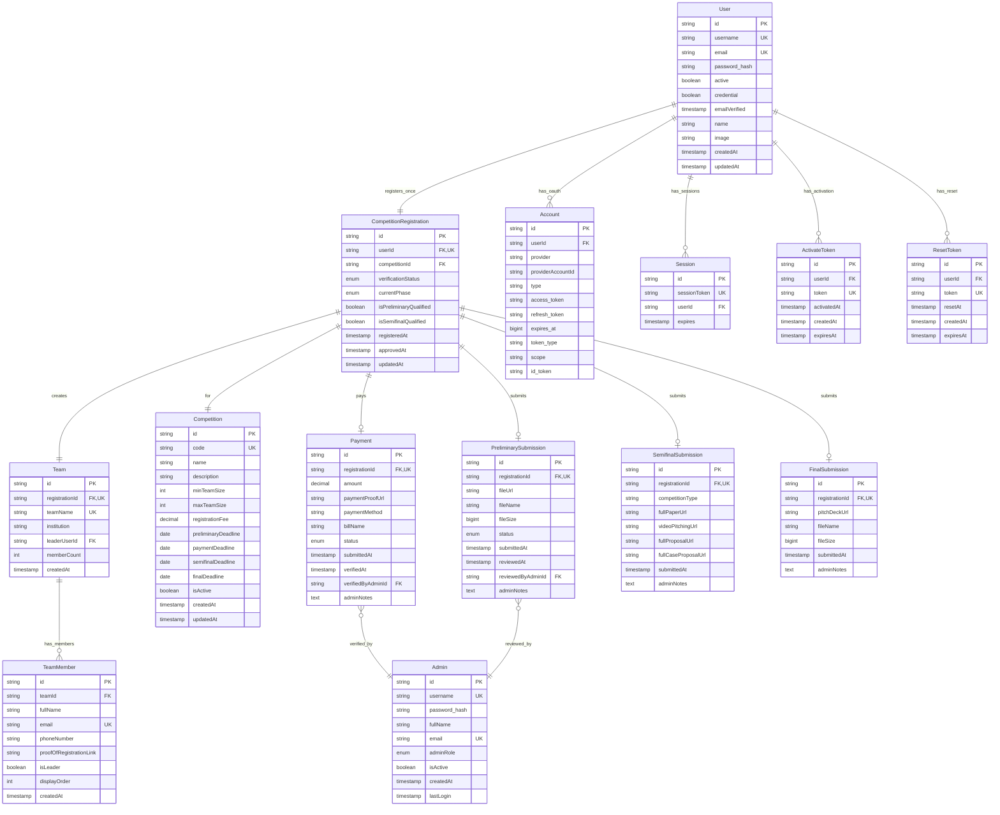

```mermaid

erDiagram
    User ||--|| CompetitionRegistration : "registers_once"
    User ||--o{ Account : "has_oauth"
    User ||--o{ Session : "has_sessions"
    User ||--o{ ActivateToken : "has_activation"
    User ||--o{ ResetToken : "has_reset"

    CompetitionRegistration ||--|| Team : "creates"
    CompetitionRegistration ||--|| Competition : "for"
    CompetitionRegistration ||--o| PreliminarySubmission : "submits"
    CompetitionRegistration ||--o| Payment : "pays"
    CompetitionRegistration ||--o| SemifinalSubmission : "submits"
    CompetitionRegistration ||--o| FinalSubmission : "submits"

    Team ||--o{ TeamMember : "has_members"

    Payment }o--|| Admin : "verified_by"
    PreliminarySubmission }o--|| Admin : "reviewed_by"

    User {
        string id PK
        string username UK
        string email UK
        string password_hash
        boolean active
        boolean credential
        timestamp emailVerified
        string name
        string image
        timestamp createdAt
        timestamp updatedAt
    }

    Account {
        string id PK
        string userId FK
        string provider
        string providerAccountId
        string type
        string access_token
        string refresh_token
        bigint expires_at
        string token_type
        string scope
        string id_token
    }

    Session {
        string id PK
        string sessionToken UK
        string userId FK
        timestamp expires
    }

    ActivateToken {
        string id PK
        string userId FK
        string token UK
        timestamp activatedAt
        timestamp createdAt
        timestamp expiresAt
    }

    ResetToken {
        string id PK
        string userId FK
        string token UK
        timestamp resetAt
        timestamp createdAt
        timestamp expiresAt
    }

    Competition {
        string id PK
        string code UK
        string name
        string description
        int minTeamSize
        int maxTeamSize
        decimal registrationFee
        date preliminaryDeadline
        date paymentDeadline
        date semifinalDeadline
        date finalDeadline
        boolean isActive
        timestamp createdAt
        timestamp updatedAt
    }

    CompetitionRegistration {
        string id PK
        string userId FK,UK
        string competitionId FK
        enum verificationStatus
        enum currentPhase
        boolean isPreliminaryQualified
        boolean isSemifinalQualified
        timestamp registeredAt
        timestamp approvedAt
        timestamp updatedAt
    }

    Team {
        string id PK
        string registrationId FK,UK
        string teamName UK
        string institution
        string leaderUserId FK
        int memberCount
        timestamp createdAt
    }

    TeamMember {
        string id PK
        string teamId FK
        string fullName
        string email UK
        string phoneNumber
        string proofOfRegistrationLink
        boolean isLeader
        int displayOrder
        timestamp createdAt
    }

    PreliminarySubmission {
        string id PK
        string registrationId FK,UK
        string fileUrl
        string fileName
        bigint fileSize
        enum status
        timestamp submittedAt
        timestamp reviewedAt
        string reviewedByAdminId FK
        text adminNotes
    }

    Payment {
        string id PK
        string registrationId FK,UK
        decimal amount
        string paymentProofUrl
        string paymentMethod
        string billName
        enum status
        timestamp submittedAt
        timestamp verifiedAt
        string verifiedByAdminId FK
        text adminNotes
    }

    SemifinalSubmission {
        string id PK
        string registrationId FK,UK
        string competitionType
        string fullPaperUrl
        string videoPitchingUrl
        string fullProposalUrl
        string fullCaseProposalUrl
        timestamp submittedAt
        text adminNotes
    }

    FinalSubmission {
        string id PK
        string registrationId FK,UK
        string pitchDeckUrl
        string fileName
        bigint fileSize
        timestamp submittedAt
        text adminNotes
    }

    Admin {
        string id PK
        string username UK
        string password_hash
        string fullName
        string email UK
        enum adminRole
        boolean isActive
        timestamp createdAt
        timestamp lastLogin
    }
```
