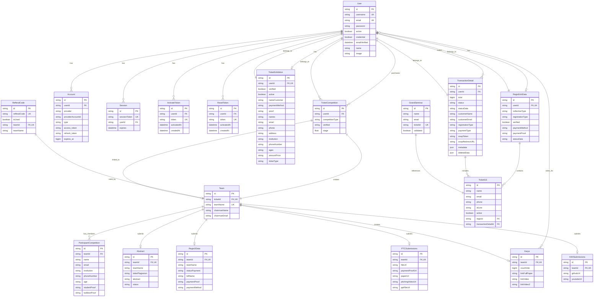
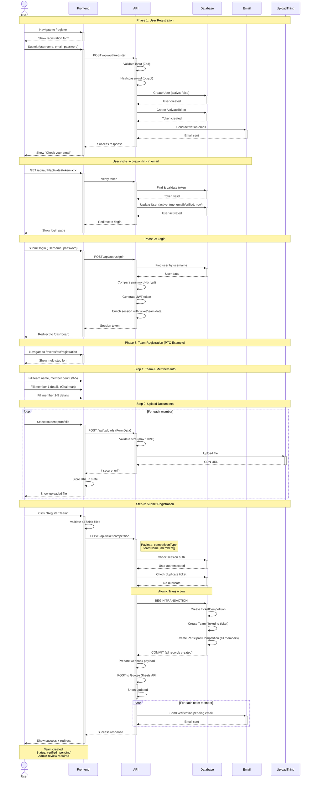
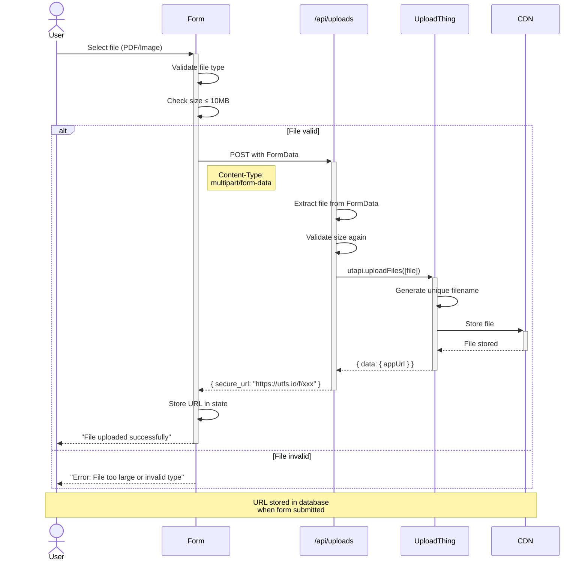
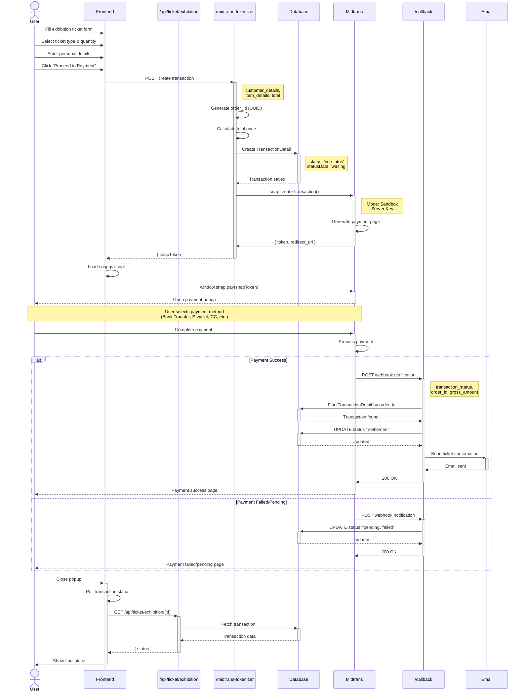
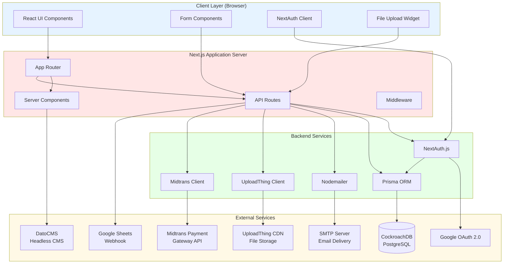
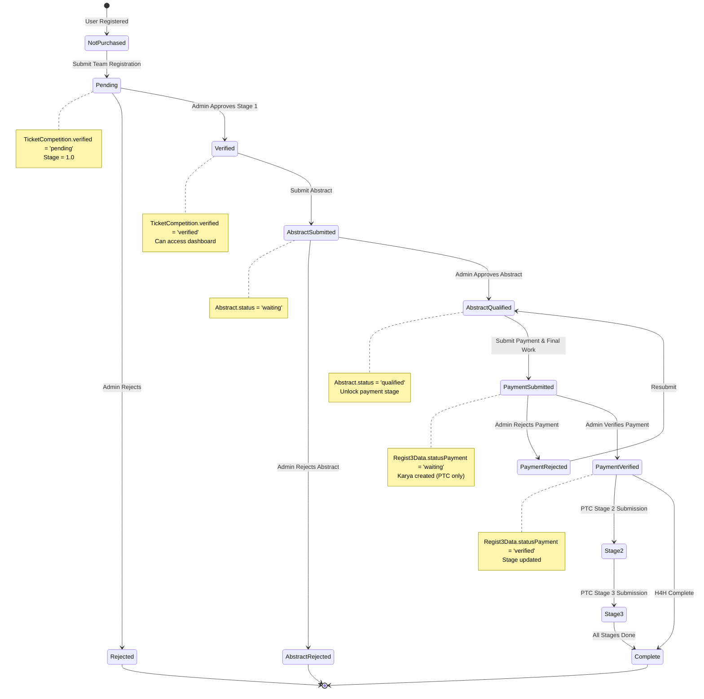
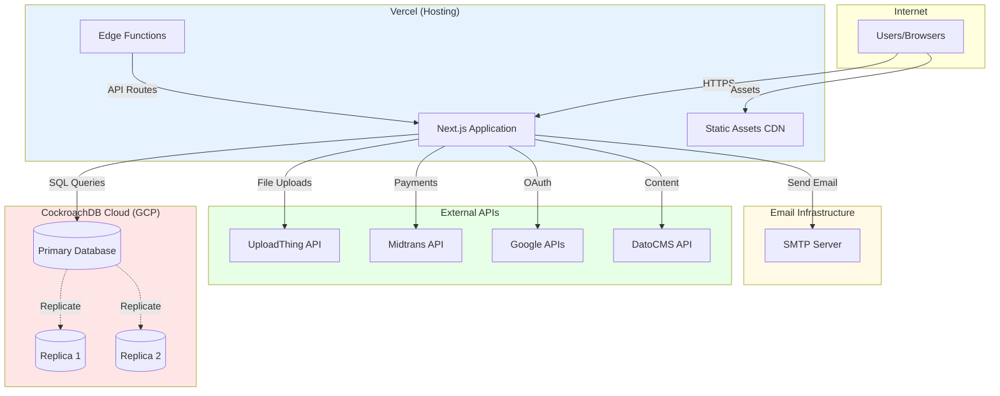

# Sandbox IEEE - System Diagrams

**Generated:** January 27, 2026  
**Based on:** Actual codebase implementation (Sandbox 2.0)

---

## Entity Relationship Diagram (ERD)



---

## Sequence Diagram 1: User Registration & Team Creation



---

## Sequence Diagram 2: Multi-Stage Submission Flow

```mermaid
sequenceDiagram
    actor Admin
    actor User
    participant Dashboard
    participant API
    participant Database
    participant FileStorage as UploadThing
    participant Email

    Note over User,Email: Stage 1 Verification (Manual by Admin)

    Admin->>+Database: Review team registration
    Admin->>Database: UPDATE TicketCompetition<br/>SET verified='verified'
    Database-->>-Admin: Updated

    Note over User,Email: Stage 2: Abstract Submission

    User->>+Dashboard: Navigate to /dashboard
    Dashboard->>+API: GET /api/team/[teamId]
    API->>+Database: Fetch team + abstract + stage
    Database-->>-API: Team data
    API-->>-Dashboard: Team info
    Dashboard->>Dashboard: Check deadline (2025-02-13)
    Dashboard->>Dashboard: Check if Stage 1 verified
    Dashboard-->>-User: Show abstract submission form

    User->>+Dashboard: Upload letter of plagiarism
    Dashboard->>+API: POST /api/uploads
    API->>+FileStorage: Upload PDF
    FileStorage-->>-API: URL
    API-->>-Dashboard: { secure_url }
    Dashboard-->>-User: File uploaded

    User->>+Dashboard: Upload abstract PDF
    Dashboard->>+API: POST /api/uploads
    API->>+FileStorage: Upload PDF
    FileStorage-->>-API: URL
    API-->>-Dashboard: { secure_url }
    Dashboard-->>-User: File uploaded

    User->>+Dashboard: Click "Submit Abstract"
    Dashboard->>+API: POST /api/regist2
    Note right of API: Payload: teamName,<br/>letterPlagiarism URL,<br/>abstract URL, type

    API->>+Database: Find team by name
    Database-->>-API: Team found
    API->>API: Check Stage 1 verified
    API->>API: Check competition type matches

    API->>+Database: Create/Update Abstract
    Note right of Database: status: 'waiting'
    Database-->>-API: Abstract saved

    loop For each team member
        API->>+Email: Send submission confirmation
        Email-->>-API: Email sent
    end

    API-->>-Dashboard: Success
    Dashboard-->>-User: "Abstract submitted!"

    Note over User,Email: Admin Reviews Abstract

    Admin->>+Database: Review abstract content
    Admin->>Database: UPDATE Abstract<br/>SET status='qualified'
    Database-->>-Admin: Qualified

    Note over User,Email: Stage 3: Payment & Final Work

    User->>+Dashboard: Refresh dashboard
    Dashboard->>+API: GET /api/team/[teamId]
    API->>+Database: Fetch team data
    Database-->>-API: Abstract.status='qualified'
    API-->>-Dashboard: Unlocked Stage 3
    Dashboard->>Dashboard: Check payment deadline (2025-02-24)
    Dashboard-->>-User: Show payment form

    User->>+Dashboard: Upload payment proof
    Dashboard->>+API: POST /api/uploads
    API->>+FileStorage: Upload image
    FileStorage-->>-API: URL
    API-->>-Dashboard: { secure_url }
    Dashboard-->>-User: Proof uploaded

    alt PTC Competition
        User->>+Dashboard: Upload full paper PDF
        Dashboard->>+API: POST /api/uploads
        API->>+FileStorage: Upload PDF
        FileStorage-->>-API: URL
        API-->>-Dashboard: { secure_url }
        Dashboard-->>-User: Paper uploaded

        User->>+Dashboard: Enter video links (YouTube)
        Dashboard-->>-User: Links saved
    end

    User->>+Dashboard: Fill bill name, payment method
    User->>Dashboard: Click "Submit Payment"
    Dashboard->>+API: POST /api/regist3
    Note right of API: Payload: teamName, paymentProof,<br/>billName, paymentMethod,<br/>karya links (PTC only)

    API->>+Database: Validate abstract qualified
    Database-->>-API: Qualified
    API->>API: Check deadline

    API->>+Database: BEGIN TRANSACTION
    Database->>Database: Create/Update Regist3Data<br/>(statusPayment: 'waiting')
    Database->>Database: Create/Update Karya<br/>(linkFullPaper, linkVideo)
    Database->>Database: Update TicketCompetition.stage
    Database-->>-API: COMMIT

    loop For each team member
        API->>+Email: Send payment confirmation
        Email-->>-API: Email sent
    end

    API-->>-Dashboard: Success
    Dashboard-->>-User: "Payment submitted!"

    Note over User,Email: Admin Verifies Payment

    Admin->>+Database: Review payment proof
    Admin->>Database: UPDATE Regist3Data<br/>SET statusPayment='verified'
    Database-->>-Admin: Payment verified

    Note over User,Database: Competition Complete!
```



---

## Sequence Diagram 3: File Upload Flow



---

## Sequence Diagram 4: Payment Flow (Exhibition/Midtrans)



---

## Activity Diagram: Complete User Journey

```mermaid
flowchart TD
    Start([User Lands on Website]) --> CheckAuth{Authenticated?}

    CheckAuth -->|No| Register[Navigate to /register]
    Register --> FillRegForm[Fill Registration Form]
    FillRegForm --> SubmitReg[Submit Registration]
    SubmitReg --> EmailSent[Activation Email Sent]
    EmailSent --> ClickLink[User Clicks Activation Link]
    ClickLink --> Activated[Account Activated]
    Activated --> Login[Navigate to /login]

    CheckAuth -->|Yes| Dashboard
    Login --> EnterCreds[Enter Username & Password]
    EnterCreds --> AuthCheck{Valid Credentials?}
    AuthCheck -->|No| LoginError[Show Error: Invalid credentials]
    LoginError --> Login
    AuthCheck -->|Yes| ActiveCheck{Account Active?}
    ActiveCheck -->|No| ActivateError[Show Error: Activate account first]
    ActivateError --> Login
    ActiveCheck -->|Yes| Dashboard[Redirect to /dashboard]

    Dashboard --> HasTicket{Has Competition<br/>Ticket?}

    HasTicket -->|No| Events[Browse /events]
    Events --> SelectComp{Select Competition}
    SelectComp -->|PTC| PTCReg[Navigate to /events/ptc/registration]
    SelectComp -->|H4H| H4HReg[Navigate to /events/h4h/registration]
    SelectComp -->|Exhibition| ExhibitionReg[Navigate to /events/exhibition]

    PTCReg --> TeamForm[Fill Team Registration Form]
    H4HReg --> TeamForm
    TeamForm --> Step1[Step 1: Team Name & Member Count]
    Step1 --> Step2[Step 2: Member Details]
    Step2 --> UploadDocs[Upload Student Proofs for All Members]
    UploadDocs --> H4HPayment{H4H Competition?}
    H4HPayment -->|Yes| UploadPayment[Upload Payment Proof]
    UploadPayment --> SubmitTeam
    H4HPayment -->|No| SubmitTeam[Submit Team Registration]
    SubmitTeam --> TeamCreated[Team Created: Status='pending']
    TeamCreated --> WaitVerif1[Wait for Admin Verification]

    ExhibitionReg --> ExhiForm[Fill Exhibition Form]
    ExhiForm --> SelectPayment[Select Payment Method]
    SelectPayment --> MidtransPay[Open Midtrans Payment Popup]
    MidtransPay --> CompletePayment[Complete Payment]
    CompletePayment --> ExhiDone[Exhibition Ticket Purchased]
    ExhiDone --> End

    HasTicket -->|Yes| CheckStage{Check Stage}
    WaitVerif1 --> AdminVerif1[Admin Verifies Team]
    AdminVerif1 --> Stage1Complete[Stage 1 Complete: verified='verified']
    Stage1Complete --> Dashboard

    CheckStage -->|Stage 1 Pending| WaitMsg[Show: Waiting for verification]
    WaitMsg --> End

    CheckStage -->|Stage 1 Verified| AbstractForm[Show Abstract Submission Form]
    AbstractForm --> CheckDeadline1{Before Abstract<br/>Deadline?}
    CheckDeadline1 -->|No| Deadline1Passed[Show: Deadline passed]
    Deadline1Passed --> End
    CheckDeadline1 -->|Yes| UploadAbstract[Upload Letter & Abstract PDF]
    UploadAbstract --> SubmitAbstract[Submit Abstract]
    SubmitAbstract --> AbstractSubmitted[Abstract: status='waiting']
    AbstractSubmitted --> WaitVerif2[Wait for Admin Review]

    WaitVerif2 --> AdminReview[Admin Reviews Abstract]
    AdminReview --> ReviewDecision{Qualified?}
    ReviewDecision -->|No| Rejected[status='rejected']
    Rejected --> End
    ReviewDecision -->|Yes| Qualified[status='qualified']
    Qualified --> Dashboard

    CheckStage -->|Abstract Qualified| PaymentForm[Show Payment Submission Form]
    PaymentForm --> CheckDeadline2{Before Payment<br/>Deadline?}
    CheckDeadline2 -->|No| Deadline2Passed[Show: Deadline passed]
    Deadline2Passed --> End
    CheckDeadline2 -->|Yes| UploadPaymentProof[Upload Payment Proof]
    UploadPaymentProof --> FillPaymentDetails[Fill Bill Name & Payment Method]
    FillPaymentDetails --> CheckCompType{Competition Type?}
    CheckCompType -->|PTC| UploadFinalWork[Upload Full Paper & Video Links]
    CheckCompType -->|H4H| SkipFinalWork[Skip Final Work]
    UploadFinalWork --> SubmitPayment
    SkipFinalWork --> SubmitPayment[Submit Payment & Final Work]
    SubmitPayment --> PaymentSubmitted[Payment: statusPayment='waiting']
    PaymentSubmitted --> WaitVerif3[Wait for Payment Verification]

    WaitVerif3 --> AdminVerifPayment[Admin Verifies Payment]
    AdminVerifPayment --> PaymentVerified[statusPayment='verified']
    PaymentVerified --> CompetitionComplete[Competition Registration Complete!]
    CompetitionComplete --> CheckMoreStages{More Stages?}

    CheckMoreStages -->|PTC: Yes| Stage2Form[Show Stage 2 Submission Form]
    Stage2Form --> UploadStage2[Upload Stage 2 Documents]
    UploadStage2 --> SubmitStage2[Submit Stage 2]
    SubmitStage2 --> Stage3Form[Show Stage 3 Submission Form]
    Stage3Form --> UploadStage3[Upload Stage 3 Final Work]
    UploadStage3 --> SubmitStage3[Submit Stage 3]
    SubmitStage3 --> AllComplete

    CheckMoreStages -->|H4H: No| AllComplete[All Stages Complete]

    AllComplete --> ViewDashboard[View Final Dashboard]
    ViewDashboard --> VotingOption{Voting Open?}
    VotingOption -->|Yes| VoteKarya[Vote on Competition Entries]
    VoteKarya --> End
    VotingOption -->|No| End

    End([End])

    style Start fill:#90EE90
    style End fill:#FFB6C1
    style Dashboard fill:#87CEEB
    style TeamCreated fill:#FFD700
    style Qualified fill:#98FB98
    style CompetitionComplete fill:#98FB98
    style AllComplete fill:#32CD32
    style Rejected fill:#FF6347
    style LoginError fill:#FF6347
    style ActivateError fill:#FF6347
    style Deadline1Passed fill:#FFA500
    style Deadline2Passed fill:#FFA500
```



---

## Architecture Diagram: System Components



---

## Data Flow Diagram: Team Registration Process

```mermaid
flowchart LR
    User([User]) -->|1. Fill Form| Frontend
    Frontend -->|2. Upload Files| UploadAPI[/api/uploads]
    UploadAPI -->|3. Store Files| UploadThing[(UploadThing CDN)]
    UploadThing -->|4. Return URLs| UploadAPI
    UploadAPI -->|5. URLs| Frontend
    Frontend -->|6. Submit Registration<br/>with URLs| TicketAPI[/api/ticket/competition]
    TicketAPI -->|7. Validate Session| NextAuth[NextAuth]
    NextAuth -->|8. Session Valid| TicketAPI
    TicketAPI -->|9. Create Team<br/>& Members| Database[(Database)]
    Database -->|10. Records Created| TicketAPI
    TicketAPI -->|11. Log to Sheet| GoogleSheets[Google Sheets]
    GoogleSheets -->|12. Logged| TicketAPI
    TicketAPI -->|13. Send Emails| Nodemailer[Email Service]
    Nodemailer -->|14. Emails Sent| TicketAPI
    TicketAPI -->|15. Success Response| Frontend
    Frontend -->|16. Show Success| User

    style User fill:#90EE90
    style Frontend fill:#87CEEB
    style Database fill:#FFD700
    style UploadThing fill:#DDA0DD
    style GoogleSheets fill:#98FB98
    style Nodemailer fill:#FFA07A
```

---

## State Diagram: Competition Ticket Lifecycle



---

## Deployment Architecture



---

## Notes on Diagrams

**Data Accuracy:**
All diagrams are generated based on actual code implementation as of Sandbox 2.0. No assumed or planned features are included.

**Key Observations:**

1. **No Team Join System:** Despite common assumptions, there is no team code or join mechanism. All team members are registered simultaneously.
2. **Multi-Stage Verification:** Admin verification is required at multiple stages (Stage 1, Abstract, Payment).
3. **File Upload Pattern:** All files go through `/api/uploads` → UploadThing → CDN URL → stored in database.
4. **Payment Timing:** Payment is NOT required upfront for competitions (except H4H). It comes after abstract qualification.
5. **Session Data:** NextAuth JWT contains extensive team and ticket data to reduce database queries.

**Diagram Usage:**

- **ERD:** Reference for database schema and relationships
- **Sequence Diagrams:** Understand API call flows and timing
- **Activity Diagram:** Overall user journey and decision points
- **Architecture Diagram:** System component dependencies
- **State Diagram:** Ticket status transitions throughout competition lifecycle
