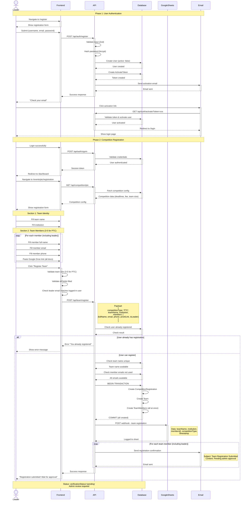

```mermaid

sequenceDiagram
    actor Leader
    participant Frontend
    participant API
    participant Database
    participant GoogleSheets
    participant Email

    Note over Leader,Email: Phase 1: User Authentication

    Leader->>+Frontend: Navigate to /register
    Frontend-->>-Leader: Show registration form
    Leader->>+Frontend: Submit (username, email, password)
    Frontend->>+API: POST /api/auth/register
    API->>API: Validate input (Zod)
    API->>API: Hash password (bcrypt)
    API->>+Database: Create User (active: false)
    Database-->>-API: User created
    API->>+Database: Create ActivateToken
    Database-->>-API: Token created
    API->>+Email: Send activation email
    Email-->>-API: Email sent
    API-->>-Frontend: Success response
    Frontend-->>-Leader: "Check your email"

    Leader->>+Email: Click activation link
    Email->>+API: GET /api/auth/activate?token=xxx
    API->>+Database: Validate token & activate user
    Database-->>-API: User activated
    API-->>-Email: Redirect to /login
    Email-->>-Leader: Show login page

    Note over Leader,Email: Phase 2: Competition Registration

    Leader->>+Frontend: Login successfully
    Frontend->>+API: POST /api/auth/signin
    API->>+Database: Validate credentials
    Database-->>-API: User authenticated
    API-->>-Frontend: Session token
    Frontend-->>-Leader: Redirect to /dashboard

    Leader->>+Frontend: Navigate to /events/ptc/registration
    Frontend->>+API: GET /api/competition/ptc
    API->>+Database: Fetch competition config
    Database-->>-API: Competition data (deadlines, fee, team size)
    API-->>-Frontend: Competition config
    Frontend-->>-Leader: Show registration form

    Note over Leader,Frontend: Section 1: Team Identity
    Leader->>+Frontend: Fill team name
    Leader->>Frontend: Fill institution

    Note over Leader,Frontend: Section 2: Team Members (3-5 for PTC)
    loop For each member (including leader)
        Leader->>Frontend: Fill member full name
        Leader->>Frontend: Fill member email
        Leader->>Frontend: Fill member phone
        Leader->>Frontend: Paste Google Drive link (all docs)
    end

    Leader->>+Frontend: Click "Register Team"
    Frontend->>Frontend: Validate team size (3-5 for PTC)
    Frontend->>Frontend: Validate all fields filled
    Frontend->>Frontend: Check leader email matches logged-in user

    Frontend->>+API: POST /api/team/register
    Note right of API: Payload:<br/>{<br/>  competitionType: 'PTC',<br/>  teamName, institution,<br/>  members: [<br/>    {fullName, email, phone, proofLink, isLeader}<br/>  ]<br/>}

    API->>+Database: Check user already registered
    Database-->>-API: Check result

    alt User already has registration
        API-->>Frontend: Error "You already registered"
        Frontend-->>Leader: Show error message
    else User can register
        API->>+Database: Check team name unique
        Database-->>-API: Team name available

        API->>+Database: Check member emails not used
        Database-->>-API: All emails available

        API->>+Database: BEGIN TRANSACTION
        Database->>Database: Create CompetitionRegistration
        Database->>Database: Create Team
        Database->>Database: Create TeamMembers (all at once)
        Database-->>-API: COMMIT (all created)

        API->>+GoogleSheets: POST webhook - team registration
        Note right of GoogleSheets: Data: teamName, institution,<br/>members[], competitionType,<br/>timestamp
        GoogleSheets-->>-API: Logged to sheet

        loop For each team member (including leader)
            API->>+Email: Send registration confirmation
            Note right of Email: Subject: Team Registration Submitted<br/>Content: Pending admin approval
            Email-->>-API: Email sent
        end

        API-->>-Frontend: Success response
        Frontend-->>-Leader: "Registration submitted! Wait for approval"
    end

    Note over Leader,Database: Status: verificationStatus='pending'<br/>Admin review required
```
