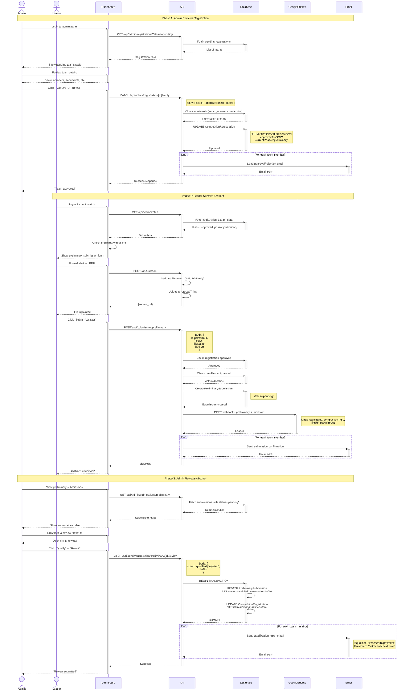

```mermaid

sequenceDiagram
    actor Admin
    actor Leader
    participant Dashboard
    participant API
    participant Database
    participant GoogleSheets
    participant Email

    Note over Admin,Email: Phase 1: Admin Reviews Registration

    Admin->>+Dashboard: Login to admin panel
    Dashboard->>+API: GET /api/admin/registrations?status=pending
    API->>+Database: Fetch pending registrations
    Database-->>-API: List of teams
    API-->>-Dashboard: Registration data
    Dashboard-->>-Admin: Show pending teams table

    Admin->>+Dashboard: Review team details
    Dashboard-->>-Admin: Show members, documents, etc.

    Admin->>+Dashboard: Click "Approve" or "Reject"
    Dashboard->>+API: PATCH /api/admin/registration/[id]/verify
    Note right of API: Body: { action: 'approve'|'reject', notes }

    API->>+Database: Check admin role (super_admin or moderator)
    Database-->>-API: Permission granted

    API->>+Database: UPDATE CompetitionRegistration
    Note right of Database: SET verificationStatus='approved',<br/>approvedAt=NOW,<br/>currentPhase='preliminary'
    Database-->>-API: Updated

    loop For each team member
        API->>+Email: Send approval/rejection email
        Email-->>-API: Email sent
    end

    API-->>-Dashboard: Success response
    Dashboard-->>-Admin: "Team approved"

    Note over Leader,Email: Phase 2: Leader Submits Abstract

    Leader->>+Dashboard: Login & check status
    Dashboard->>+API: GET /api/team/status
    API->>+Database: Fetch registration & team data
    Database-->>-API: Status: approved, phase: preliminary
    API-->>-Dashboard: Team data
    Dashboard->>Dashboard: Check preliminary deadline
    Dashboard-->>-Leader: Show preliminary submission form

    Leader->>+Dashboard: Upload abstract PDF
    Dashboard->>+API: POST /api/uploads
    API->>API: Validate file (max 10MB, PDF only)
    API->>API: Upload to UploadThing
    API-->>-Dashboard: {secure_url}
    Dashboard-->>-Leader: File uploaded

    Leader->>+Dashboard: Click "Submit Abstract"
    Dashboard->>+API: POST /api/submission/preliminary
    Note right of API: Body: {<br/>  registrationId,<br/>  fileUrl,<br/>  fileName,<br/>  fileSize<br/>}

    API->>+Database: Check registration approved
    Database-->>-API: Approved

    API->>+Database: Check deadline not passed
    Database-->>-API: Within deadline

    API->>+Database: Create PreliminarySubmission
    Note right of Database: status='pending'
    Database-->>-API: Submission created

    API->>+GoogleSheets: POST webhook - preliminary submission
    Note right of GoogleSheets: Data: teamName, competitionType,<br/>fileUrl, submittedAt
    GoogleSheets-->>-API: Logged

    loop For each team member
        API->>+Email: Send submission confirmation
        Email-->>-API: Email sent
    end

    API-->>-Dashboard: Success
    Dashboard-->>-Leader: "Abstract submitted!"

    Note over Admin,Email: Phase 3: Admin Reviews Abstract

    Admin->>+Dashboard: View preliminary submissions
    Dashboard->>+API: GET /api/admin/submissions/preliminary
    API->>+Database: Fetch submissions with status='pending'
    Database-->>-API: Submission list
    API-->>-Dashboard: Submission data
    Dashboard-->>-Admin: Show submissions table

    Admin->>+Dashboard: Download & review abstract
    Dashboard-->>-Admin: Open file in new tab

    Admin->>+Dashboard: Click "Qualify" or "Reject"
    Dashboard->>+API: PATCH /api/admin/submission/preliminary/[id]/review
    Note right of API: Body: {<br/>  action: 'qualified'|'rejected',<br/>  notes<br/>}

    API->>+Database: BEGIN TRANSACTION
    Database->>Database: UPDATE PreliminarySubmission<br/>SET status='qualified', reviewedAt=NOW
    Database->>Database: UPDATE CompetitionRegistration<br/>SET isPreliminaryQualified=true
    Database-->>-API: COMMIT

    loop For each team member
        API->>+Email: Send qualification result email
        Note right of Email: If qualified: "Proceed to payment"<br/>If rejected: "Better luck next time"
        Email-->>-API: Email sent
    end

    API-->>-Dashboard: Success
    Dashboard-->>-Admin: "Review submitted"
```
