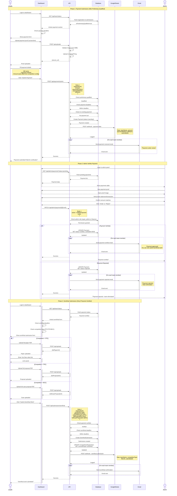

```mermaid
sequenceDiagram
    actor Leader
    participant Dashboard
    participant API
    participant Database
    participant GoogleSheets
    participant Email
    actor Admin

    Note over Leader,Admin: Phase 1: Payment Submission (After Preliminary Qualified)

    Leader->>+Dashboard: Login to dashboard
    Dashboard->>+API: GET /api/team/status
    API->>+Database: Fetch registration & submissions
    Database-->>-API: isPreliminaryQualified=true
    API-->>-Dashboard: Unlock payment section
    Dashboard->>Dashboard: Check payment deadline
    Dashboard-->>-Leader: Show payment form

    Leader->>+Dashboard: Upload payment proof (screenshot)
    Dashboard->>+API: POST /api/uploads
    API->>API: Validate image (max 5MB)
    API->>API: Upload to UploadThing
    API-->>-Dashboard: {secure_url}
    Dashboard-->>-Leader: Proof uploaded

    Leader->>+Dashboard: Fill payment details
    Note right of Leader: - Bill name<br/>- Payment method<br/>- Amount (auto-filled from competition config)

    Leader->>+Dashboard: Click "Submit Payment"
    Dashboard->>+API: POST /api/payment/submit
    Note right of API: Body: {<br/>  registrationId,<br/>  amount,<br/>  paymentProofUrl,<br/>  paymentMethod,<br/>  billName<br/>}

    API->>+Database: Check preliminary qualified
    Database-->>-API: Qualified

    API->>+Database: Check payment deadline
    Database-->>-API: Within deadline

    API->>+Database: Check no existing payment
    Database-->>-API: No payment yet

    API->>+Database: Create Payment (status='pending')
    Database-->>-API: Payment created

    API->>+GoogleSheets: POST webhook - payment data
    Note right of GoogleSheets: Data: teamName, amount,<br/>paymentMethod, billName,<br/>submittedAt
    GoogleSheets-->>-API: Logged

    loop For each team member
        API->>+Email: Send payment received email
        Note right of Email: "Payment under review"
        Email-->>-API: Email sent
    end

    API-->>-Dashboard: Success
    Dashboard-->>-Leader: "Payment submitted! Wait for verification"

    Note over Admin,Leader: Phase 2: Admin Verifies Payment

    Admin->>+Dashboard: Login to admin panel
    Dashboard->>+API: GET /api/admin/payments?status=pending
    API->>+Database: Fetch pending payments
    Database-->>-API: Payment list
    API-->>-Dashboard: Payment data
    Dashboard-->>-Admin: Show payments table

    Admin->>+Dashboard: View payment proof
    Dashboard-->>-Admin: Open proof image

    Admin->>+Dashboard: Verify bank statement/transaction
    Dashboard-->>-Admin: Confirm amount matches

    Admin->>+Dashboard: Click "Verify" or "Reject"
    Dashboard->>+API: PATCH /api/admin/payment/[id]/verify
    Note right of API: Body: {<br/>  action: 'verified'|'rejected',<br/>  notes<br/>}

    API->>+Database: Check admin role (super_admin or finance)
    Database-->>-API: Permission granted

    alt Payment Verified
        API->>+Database: UPDATE Payment<br/>SET status='verified', verifiedAt=NOW
        Database-->>-API: Updated

        loop For each team member
            API->>+Email: Send payment verified email
            Note right of Email: "Payment approved!<br/>You can now submit semifinal work"
            Email-->>-API: Email sent
        end

        API-->>Dashboard: Success
        Dashboard-->>Admin: "Payment verified"

    else Payment Rejected
        API->>+Database: UPDATE Payment<br/>SET status='rejected'
        Database-->>-API: Updated

        loop For each team member
            API->>+Email: Send payment rejected email
            Note right of Email: "Payment rejected.<br/>Team eliminated."
            Email-->>-API: Email sent
        end

        API-->>Dashboard: Success
        Dashboard-->>Admin: "Payment rejected - team eliminated"
    end

    Note over Leader,Email: Phase 3: Semifinal Submission (Only if Payment Verified)

    Leader->>+Dashboard: Login to dashboard
    Dashboard->>+API: GET /api/team/status
    API->>+Database: Fetch payment status
    Database-->>-API: Payment verified
    API-->>-Dashboard: Unlock semifinal form
    Dashboard->>Dashboard: Check semifinal deadline
    Dashboard->>Dashboard: Check competition type (PTC/TPC/BCC)
    Dashboard-->>-Leader: Show semifinal submission form

    alt Competition = PTC
        Leader->>+Dashboard: Upload full paper PDF
        Dashboard->>+API: POST /api/uploads
        API-->>-Dashboard: {fullPaperUrl}
        Dashboard-->>-Leader: Paper uploaded

        Leader->>+Dashboard: Enter YouTube video link
        Dashboard-->>-Leader: Link saved

    else Competition = TPC
        Leader->>+Dashboard: Upload full proposal PDF
        Dashboard->>+API: POST /api/uploads
        API-->>-Dashboard: {fullProposalUrl}
        Dashboard-->>-Leader: Proposal uploaded

    else Competition = BCC
        Leader->>+Dashboard: Upload full case proposal PDF
        Dashboard->>+API: POST /api/uploads
        API-->>-Dashboard: {fullCaseProposalUrl}
        Dashboard-->>-Leader: Case uploaded
    end

    Leader->>+Dashboard: Click "Submit Semifinal Work"
    Dashboard->>+API: POST /api/submission/semifinal
    Note right of API: Body: {<br/>  registrationId,<br/>  competitionType,<br/>  fullPaperUrl (PTC),<br/>  videoPitchingUrl (PTC),<br/>  fullProposalUrl (TPC),<br/>  fullCaseProposalUrl (BCC)<br/>}

    API->>+Database: Check payment verified
    Database-->>-API: Verified

    API->>+Database: Check semifinal deadline
    Database-->>-API: Within deadline

    API->>+Database: Create SemifinalSubmission
    Database-->>-API: Submission created

    API->>+Database: UPDATE CompetitionRegistration<br/>SET currentPhase='semifinal'
    Database-->>-API: Updated

    API->>+GoogleSheets: POST webhook - semifinal submission
    Note right of GoogleSheets: Data: teamName, competitionType,<br/>fileUrls, submittedAt
    GoogleSheets-->>-API: Logged

    loop For each team member
        API->>+Email: Send semifinal confirmation
        Email-->>-API: Email sent
    end

    API-->>-Dashboard: Success
    Dashboard-->>-Leader: "Semifinal work submitted!"

```
