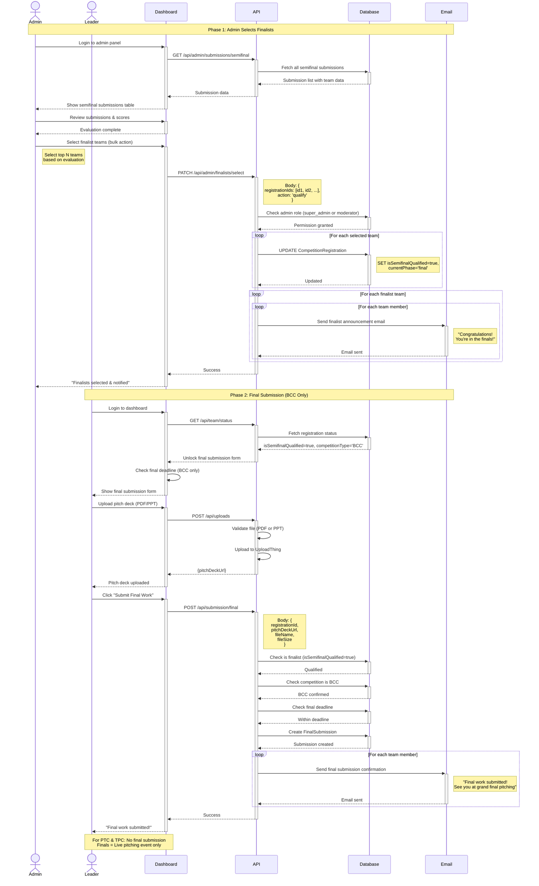

```mermaid
sequenceDiagram
    actor Admin
    actor Leader
    participant Dashboard
    participant API
    participant Database
    participant Email
    
    Note over Admin,Email: Phase 1: Admin Selects Finalists
    
    Admin->>+Dashboard: Login to admin panel
    Dashboard->>+API: GET /api/admin/submissions/semifinal
    API->>+Database: Fetch all semifinal submissions
    Database-->>-API: Submission list with team data
    API-->>-Dashboard: Submission data
    Dashboard-->>-Admin: Show semifinal submissions table
    
    Admin->>+Dashboard: Review submissions & scores
    Dashboard-->>-Admin: Evaluation complete
    
    Admin->>+Dashboard: Select finalist teams (bulk action)
    Note right of Admin: Select top N teams<br/>based on evaluation
    
    Dashboard->>+API: PATCH /api/admin/finalists/select
    Note right of API: Body: {<br/>  registrationIds: [id1, id2, ...],<br/>  action: 'qualify'<br/>}
    
    API->>+Database: Check admin role (super_admin or moderator)
    Database-->>-API: Permission granted
    
    loop For each selected team
        API->>+Database: UPDATE CompetitionRegistration
        Note right of Database: SET isSemifinalQualified=true,<br/>currentPhase='final'
        Database-->>-API: Updated
    end
    
    loop For each finalist team
        loop For each team member
            API->>+Email: Send finalist announcement email
            Note right of Email: "Congratulations!<br/>You're in the finals!"
            Email-->>-API: Email sent
        end
    end
    
    API-->>-Dashboard: Success
    Dashboard-->>-Admin: "Finalists selected & notified"
    
    Note over Leader,Email: Phase 2: Final Submission (BCC Only)
    
    Leader->>+Dashboard: Login to dashboard
    Dashboard->>+API: GET /api/team/status
    API->>+Database: Fetch registration status
    Database-->>-API: isSemifinalQualified=true, competitionType='BCC'
    API-->>-Dashboard: Unlock final submission form
    Dashboard->>Dashboard: Check final deadline (BCC only)
    Dashboard-->>-Leader: Show final submission form
    
    Leader->>+Dashboard: Upload pitch deck (PDF/PPT)
    Dashboard->>+API: POST /api/uploads
    API->>API: Validate file (PDF or PPT)
    API->>API: Upload to UploadThing
    API-->>-Dashboard: {pitchDeckUrl}
    Dashboard-->>-Leader: Pitch deck uploaded
    
    Leader->>+Dashboard: Click "Submit Final Work"
    Dashboard->>+API: POST /api/submission/final
    Note right of API: Body: {<br/>  registrationId,<br/>  pitchDeckUrl,<br/>  fileName,<br/>  fileSize<br/>}
    
    API->>+Database: Check is finalist (isSemifinalQualified=true)
    Database-->>-API: Qualified
    
    API->>+Database: Check competition is BCC
    Database-->>-API: BCC confirmed
    
    API->>+Database: Check final deadline
    Database-->>-API: Within deadline
    
    API->>+Database: Create FinalSubmission
    Database-->>-API: Submission created
    
    loop For each team member
        API->>+Email: Send final submission confirmation
        Note right of Email: "Final work submitted!<br/>See you at grand final pitching"
        Email-->>-API: Email sent
    end
    
    API-->>-Dashboard: Success
    Dashboard-->>-Leader: "Final work submitted!"
    
    Note over Leader,Dashboard: For PTC & TPC: No final submission<br/>Finals = Live pitching event only

```